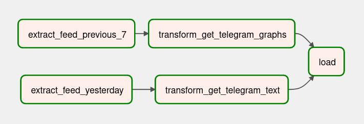
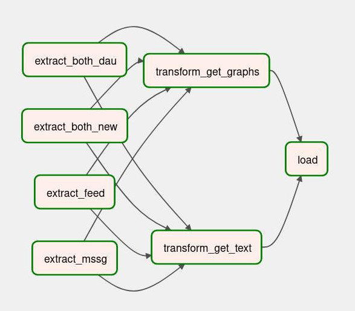

# Apache Airflow и ETL-пайплайны для анализа Новостной Ленты
Данный репозиторий содержит различные скрипты для формирования регулярных отчетов по ключевым метрикам продукта, состоящего из ленты новостей и мессенджера, используя Apache Airflow и Python, с последующей отправкой в ClickHouse или Telegram.

## [airflow_clickhouse.py](airflow_clickhouse.py)
Данный скрипт содержит Airflow-DAG для создания отчета,
который для каждого пользователя приложения считает:
* количество просмотров и лайков контента в ленте новостей
* количество полученных и отправленных сообщений в мессенджере
* количество отправителей сообщений пользователю и количество получателей сообщений пользователя

Также все эти метрики рассчитываются в разрезах по полу, возрасту и операционной системе пользователя.
Готовый отчет ежедневно выгружается в ClickHouse.

## [airflow_newsfeed_telegram.py](airflow_newsfeed_telegram.py)
Данный скрипт содержит Airflow-DAG
для формирования отчета по ленте новостей
и для автоматической ежедневной отправки аналитической сводки в Telegram.
Аналитическая сводка включает в себя
значения метрик за предыдущий день
и графики метрик за предыдущую неделю
для следующих ключевых метрик:
* Активные пользователи за сутки (Daily Active Users, DAU)
* Просмотры (Views)
* Лайки (Likes)
* Кликабельность (Click-through rate, CTR)

## [airflow_application_telegram.py](airflow_application_telegram.py)
Данный скрипт содержит Airflow-DAG
для формирования отчета по всему приложению (ленте новостей и сервису отправки сообщений)
и для автоматической ежедневной отправки аналитической сводки в Telegram.
Аналитическая сводка включает в себя значения и графики для следующих ключевых метрик:
* Активные пользователи за сутки (Daily Active Users, DAU)
* Новые пользователи
* Новостные посты
* Просмотры (Views)
* Лайки (Likes)
* Лайков на пользователя (Likes per user, LPU)
* Кликабельность (Click-through rate, CTR)
* Сообщений на пользователя (Messages per user, MPU)
* и др.

## [airflow_anomaly_telegram.py](airflow_anomaly_telegram.py)
Данный скрипт содержит Airflow-DAG
для формирования аналитической сводки по поведению продуктовых метрик
и для последующей отправки в Telegram
в случае аномального поведения метрик.
Аномальное поведение ключевых метрик выявляется с помощью техники межквартильного размаха.
Аналитическая сводка включает в себя значения и графики для следующих ключевых метрик:
* Активные пользователи за сутки (Daily Active Users, DAU)
* Просмотры (Views)
* Лайки (Likes)
* Просмотров на пользователя (Views per user, VPU)
* Лайков на пользователя (Likes per user, LPU)
* Кликабельность (Click-through rate, CTR)
* Сообщения (Messages)
* Сообщений на пользователя (Messages per user, MPU)

